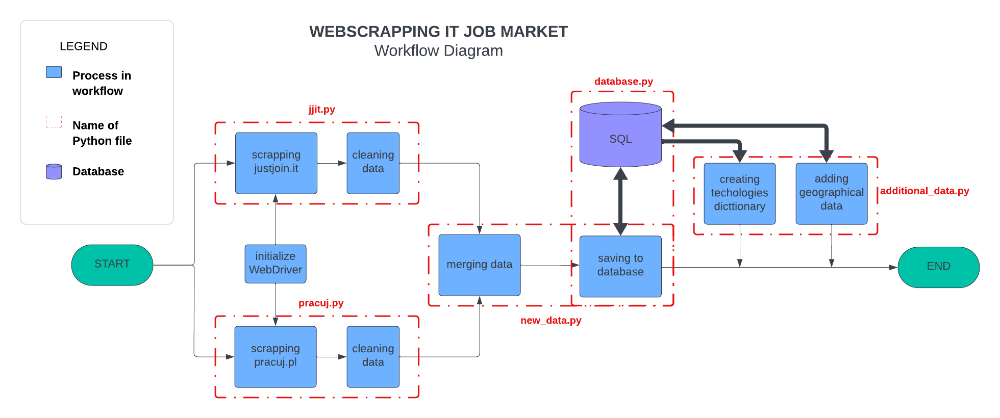

# Webscrapping IT Job Market

## General info

This project is a web scraping and data processing application designed to extract, process, and store job 
offer data from two most popular job searching websites for IT branch in Poland: justjoin.it and pracuj.pl. 
It's tailored for users interested in aggregating job market informations, including details like job titles, 
companies, salaries, locations, and technologies. This tool is particularly useful for job market analysis
(which is the subject of my next project) and personal job search.

## Technologies used

Project was done using Python3 in PyCharm IDE. Main libraries:

- BeautifulSoup (for web scraping)
- Selenium WebDriver (for browser automation)
- Requests (for parsing json data)
- SQLite (for database management)
- Pandas (for data processing)

## Project Structure and Solutions

Before diving into the code I encourage you to check out the project workflow chart below. It should give
you the outlook on how the application works. After that I will discuss each file in details. If you would like
to dive deeper I encourage you to examine code - all functions are described using docstrings.

<b>commons.py</b>: Sets up and configures a Chrome WebDriver for web scraping for both: jjit and pracuj.pl scrappers.

<b>jjit.py</b>: File contains all functions used to navigate justjoin.it. Due to the site design it was necessary to 
scroll down through the page to reveal all job offers. While scrolling, job offers details were parsed using 
BeautifulSoup. This file also contains data cleaning functions. In the end it forwards pandas DataFrame standarized 
with the similar data from pracuj.pl

<b>pracuj.py</b>: Web scraping module similar to 'jjit.py' but adapted to pracuj.pl architecture (without scrolling).
It also maps for us categories and technologies selected as search criterias (we use standarized categories for
both sites based on jjit categories). As jjit.py it performs cleaning and handles standarized DataFrame in the end

<b>new_data.py</b>: File with widest variety of functions that coordinates whole application. Besides that, 
it provides us with verification of search criterias, merging data from both sources and saving to database.

<b>database.py</b>: Manages database operations using SQL. Handles the creation of a database and 
data storage/retrieval used by other functions.

<b>additional_data.py</b>: This file contains functions which enrich our data and enable further analysis. 
First of them is technologies dictionary which counts the occurences of particular technology in keywords.
Second one searches external data source (nominatim.openstreetmap.org) in order to assign geographical data
based on location given in offer

Enjoy!
